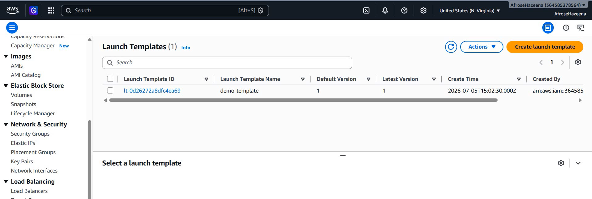
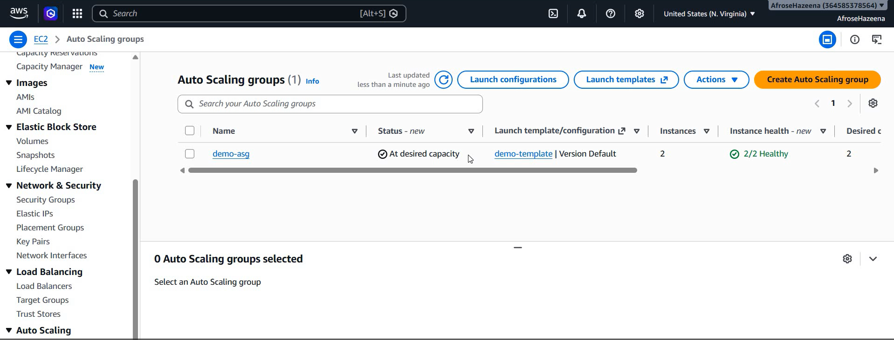
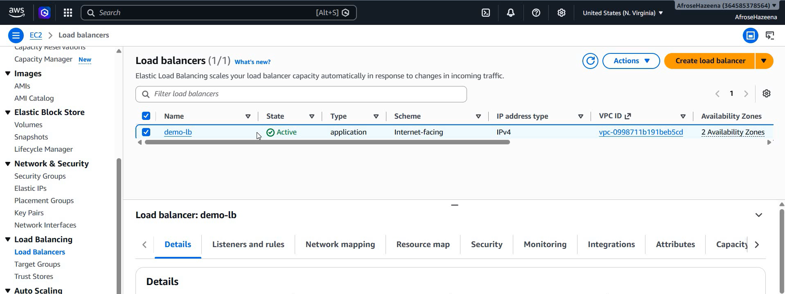
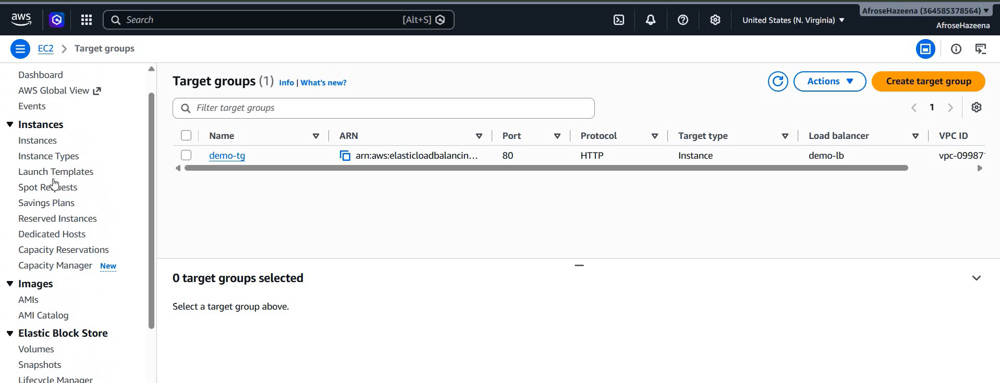
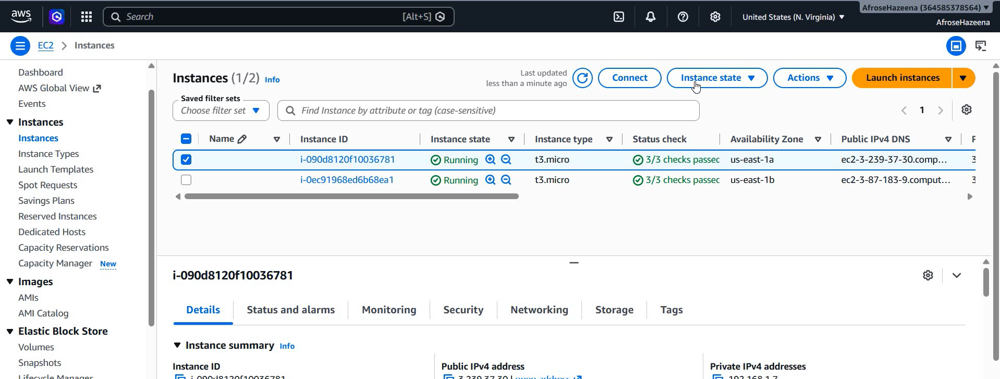
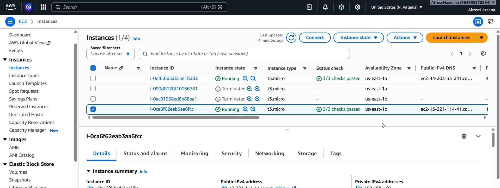

# AWS Lab – Amazon EC2 Auto Scaling Group

## Overview

Amazon EC2 Auto Scaling helps maintain application availability by automatically launching or terminating EC2 instances based on application demand. Combined with an Application Load Balancer (ALB), it ensures high availability, fault tolerance, and efficient resource utilization.

In this lab, we create a Launch Template, configure an Auto Scaling Group, attach it to an Application Load Balancer, and automatically maintain the desired number of EC2 instances across multiple Availability Zones.

---

## Architecture

.png)

### Components

- Amazon EC2
- Launch Template
- Auto Scaling Group (ASG)
- Application Load Balancer (ALB)
- Target Group
- Amazon SNS
- Amazon VPC
- Public Subnets

---

## Step 1: Create a Launch Template

Navigate to **EC2 → Launch Templates** and create a new Launch Template.

Configure:

The Launch Template defines the configuration used whenever Auto Scaling launches a new EC2 instance.

---

## Step 2: Create an Auto Scaling Group

Navigate to **EC2 → Auto Scaling Groups** and create a new Auto Scaling Group.

Configure:

- Launch Template
- Custom VPC
- Two Public Subnets
- Desired Capacity: **2**
- Minimum Capacity: **1**
- Maximum Capacity: **4**

The Auto Scaling Group automatically maintains the required number of EC2 instances.

---

## Step 3: Attach an Application Load Balancer

While creating the Auto Scaling Group:

- Create a new Internet-facing Application Load Balancer
- Create a Target Group
- Enable Elastic Load Balancing Health Checks

The Application Load Balancer distributes incoming traffic across healthy EC2 instances.

---

## Step 4: Verify Target Group

The Target Group automatically registers EC2 instances launched by the Auto Scaling Group.

Healthy instances begin receiving traffic from the Application Load Balancer.

---

## Step 5: Verify Auto Scaling Instances

After the Auto Scaling Group is created, verify that the desired number of EC2 instances are launched automatically.

If an instance becomes unhealthy or demand changes, Auto Scaling automatically launches or terminates instances to maintain the configured capacity.

---

## Step 6: Monitor Running Instances

Navigate to the EC2 Console and verify that the Auto Scaling Group has successfully launched the required EC2 instances.

---

## Conclusion

In this lab, we:

- Created an EC2 Launch Template.
- Configured an Auto Scaling Group.
- Defined minimum, desired, and maximum instance capacity.
- Created an Application Load Balancer.
- Configured a Target Group.
- Enabled Elastic Load Balancer Health Checks.
- Verified automatic EC2 instance creation and registration.

Amazon EC2 Auto Scaling improves application availability by automatically adjusting the number of EC2 instances based on demand while working seamlessly with Application Load Balancer to distribute incoming traffic.

