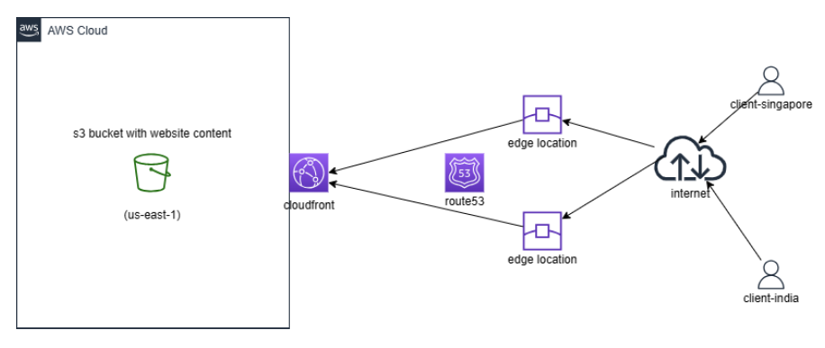
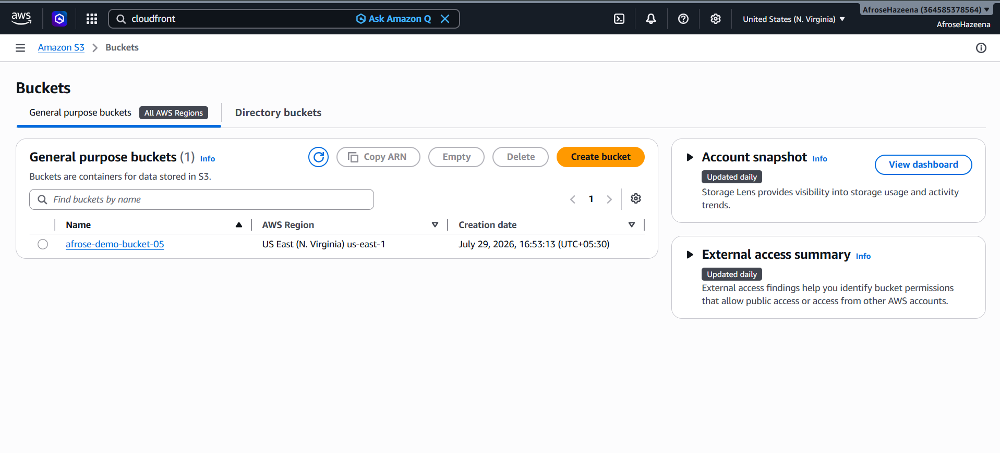
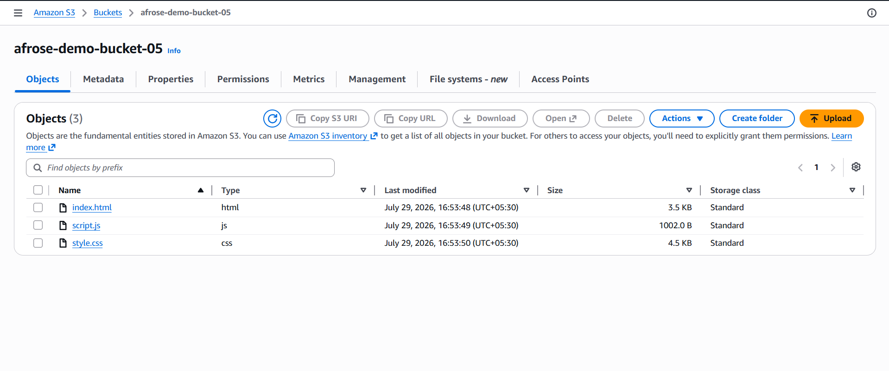
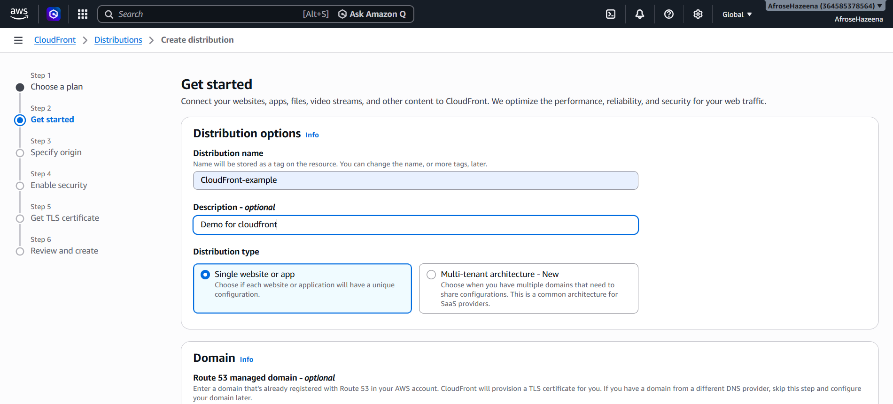
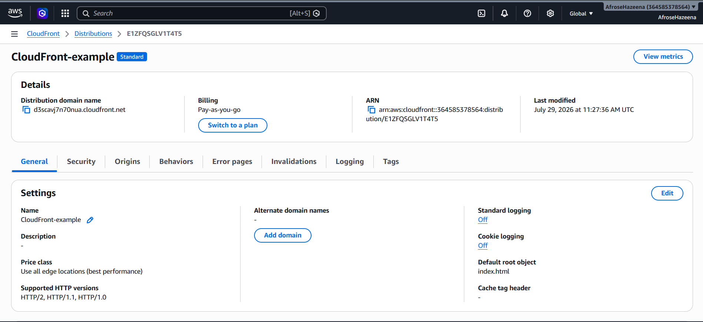
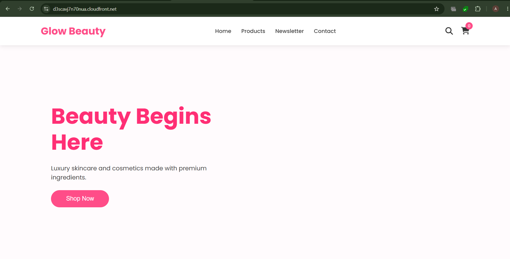

# AWS Lab – Amazon CloudFront Distribution with Amazon S3

## Overview

Amazon CloudFront is a fast and secure Content Delivery Network (CDN) that delivers web content with low latency and high transfer speeds through a global network of Edge Locations. When integrated with Amazon S3, CloudFront caches website content closer to users, improving performance and reducing the load on the origin bucket.

In this lab, we create an Amazon S3 bucket, upload a static website, configure an Amazon CloudFront distribution, and access the website through the CloudFront distribution domain.

---

## Architecture



### Components

- Amazon S3 Bucket
- Static Website Content
- Amazon CloudFront
- Edge Locations
- Internet Users

---

## Step 1: Create an Amazon S3 Bucket

Navigate to **Amazon S3** and create a new bucket.

Configuration:

- **Bucket Name:** Unique bucket name
- **Region:** `us-east-1`

The S3 bucket acts as the origin for the CloudFront distribution.



---

## Step 2: Upload Website Content

Open the S3 bucket and upload the static website files.

Example files:

- `index.html`
- CSS
- JavaScript
- Images

These files will be served through Amazon CloudFront.



---

## Step 3: Create a CloudFront Distribution

Navigate to **Amazon CloudFront** and create a new distribution.

Configuration:

- **Origin Type:** Amazon S3
- **Origin:** Select the S3 bucket
- **Security Protection (WAF):** Not Enabled
- **Distribution Type:** Single Website or App

CloudFront creates a global distribution using the S3 bucket as the origin.



---

## Step 4: Configure the Default Root Object

After the distribution is created:

- Edit the distribution settings.
- Configure the **Default Root Object** as:

```text
index.html
```

This ensures that the homepage loads automatically when accessing the CloudFront URL.



---

## Step 5: Access the Website

Wait until the CloudFront distribution status changes from **Deploying** to **Deployed**.

Copy the **Distribution Domain Name** and open it in a web browser.

The website is now delivered through Amazon CloudFront using the nearest Edge Location.



---

## Conclusion

In this lab, we:

- Created an Amazon S3 bucket.
- Uploaded static website content.
- Created an Amazon CloudFront distribution.
- Configured Amazon S3 as the origin.
- Set the default root object.
- Accessed the website through the CloudFront distribution URL.

Amazon CloudFront improves website performance by caching content at Edge Locations worldwide, providing low latency, faster content delivery, enhanced scalability, and secure access for users across the globe.
