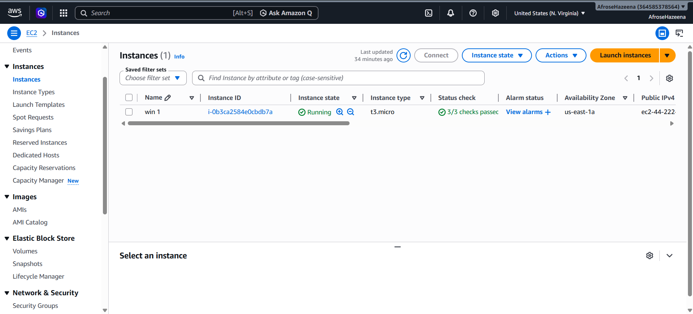
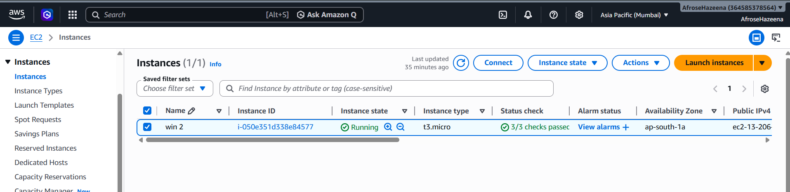
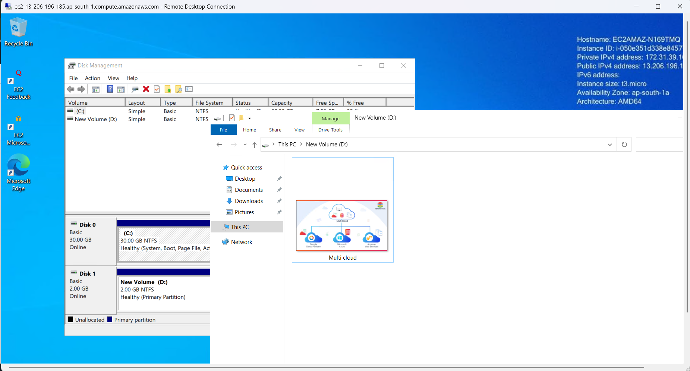
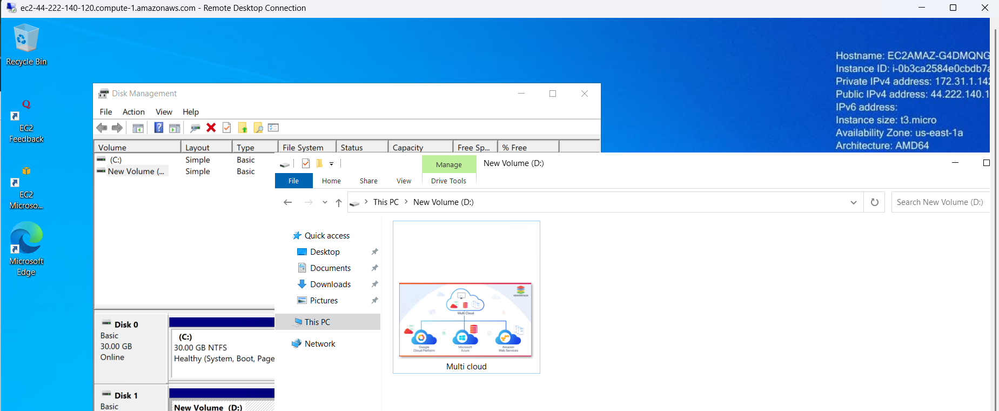

# AWS EBS Snapshots Lab

## Objective
This lab demonstrates how to create Amazon EBS snapshots, copy snapshots between AWS regions, and create new volumes from snapshots using Windows EC2 instances.

---

# AWS Services Used
- Amazon EC2
- Amazon EBS
- Amazon EBS Snapshots

---

# Lab Architecture

---

# Step 1: Launch Windows EC2 Instances

Two Windows EC2 instances were launched in different AWS regions:
- Mumbai Region
- N. Virginia Region

## N. Virginia Instance

## Mumbai Instance

---

# Step 2: Create EBS Snapshot

An EBS snapshot was created from the attached volume of the EC2 instance.

## Snapshot Created

---

# Step 3: Copy Snapshot Across Regions

The snapshot was copied from one AWS region to another for backup and disaster recovery purposes.

## Copied Snapshot

---

# Step 4: Create Volume from Snapshot

A new EBS volume was created using the copied snapshot.

## Volume from Snapshot

---

# Step 5: Connect Using Remote Desktop (RDP)

Remote Desktop Protocol (RDP) was used to connect to both Windows EC2 instances.

## Mumbai RDP Connection

## N. Virginia RDP Connection

---

# Key Learnings
- Launching Windows EC2 instances
- Connecting through RDP
- Creating EBS snapshots
- Copying snapshots between AWS regions
- Restoring storage using snapshots
- Disaster recovery concepts in AWS

---

# Conclusion
This lab successfully demonstrated AWS EBS snapshot management, cross-region snapshot copying, and volume restoration using Windows EC2 instances.
