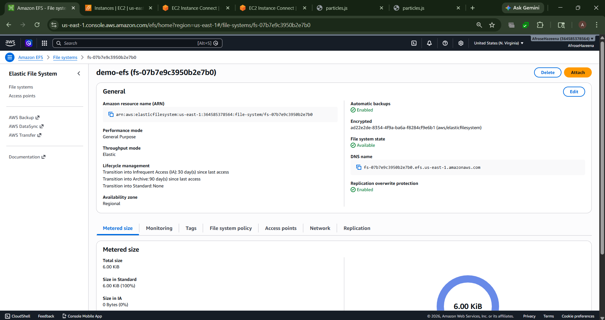
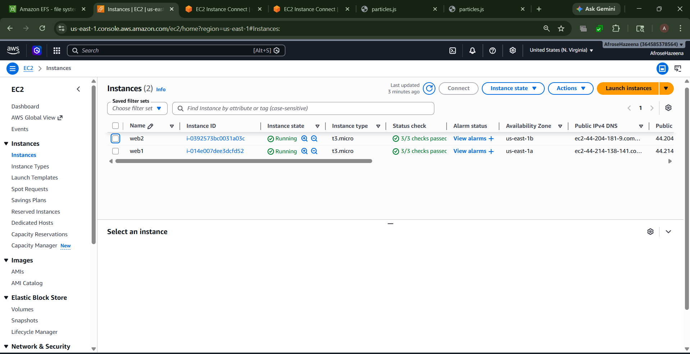
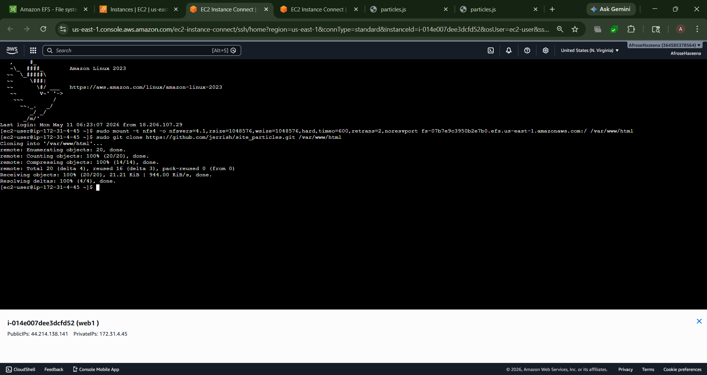
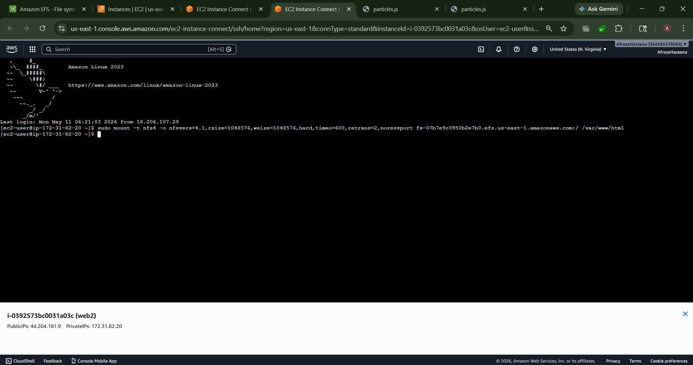
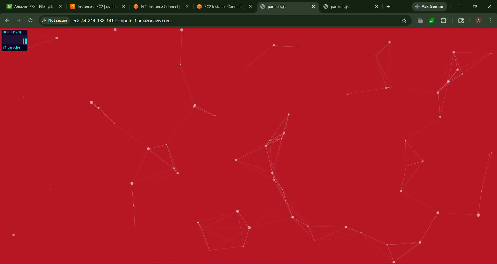
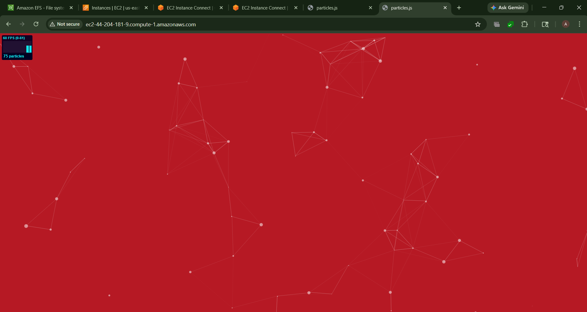

# AWS Lab– File Sharing with Amazon Elastic File System (EFS)

## Overview

Amazon Elastic File System (EFS) is a fully managed, scalable, and highly available file storage service that uses the NFS protocol. It enables multiple EC2 instances to access and share the same file system simultaneously.

In this lab, we create an EFS file system and mount it on two Apache web servers running in different Availability Zones. Website files stored in EFS are automatically synchronized across both servers.

---

## Architecture



### Components

- Amazon EFS
- EC2 Instance (linux-webserver1) – us-east-1a
- EC2 Instance (linux-webserver2) – us-east-1b
- Apache Web Server
- Shared Website Content (`/var/www/html`)

---

## Step 1: Launch Two EC2 Instances

Create two Amazon Linux EC2 instances in different Availability Zones:

| Instance Name | Availability Zone |
|--------------|-------------------|
| linux-webserver1 | us-east-1a |
| linux-webserver2 | us-east-1b |

Install Apache using User Data:

```bash
#!/bin/bash

dnf install httpd git -y
systemctl start httpd
systemctl enable httpd
```




---

## Step 2: Create an Amazon EFS File System

Navigate to **Amazon EFS** and create a file system named:

```text
demo-efs-website-data
```


---

## Step 3: Mount EFS on Both EC2 Instances

SSH into both instances and mount the EFS file system to the Apache document root:

```bash
sudo mount -t nfs4 <efs-dns-name>:/ /var/www/html
```

Verify:

```bash
df -h
```




---

## Step 5: Deploy Website Content

Clone the sample website into the shared EFS directory:

```bash
sudo git clone https://github.com/jerrish/site_particles.git /var/www/html
```

Since both servers use the same EFS storage, the website content is automatically available on both instances.


---

## Step 6: Verify File Sharing

Access both EC2 public IP addresses.

The same website should be displayed from both servers, confirming successful file sharing through Amazon EFS.





---

## Conclusion

In this lab, we:

- Created two EC2 web servers.
- Created an Amazon EFS file system.
- Configured NFS access.
- Mounted EFS on multiple EC2 instances.
- Shared website files across both servers.
- Verified real-time synchronization using Amazon EFS.
