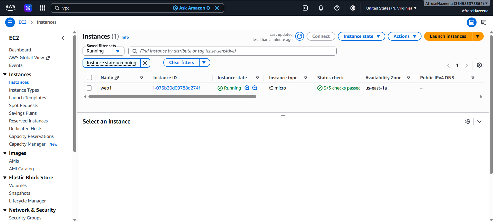
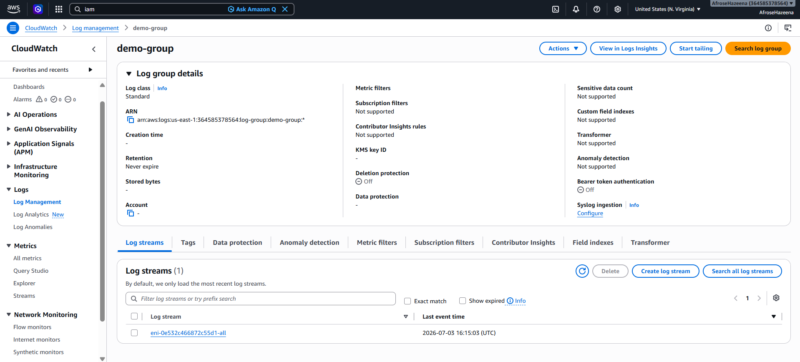
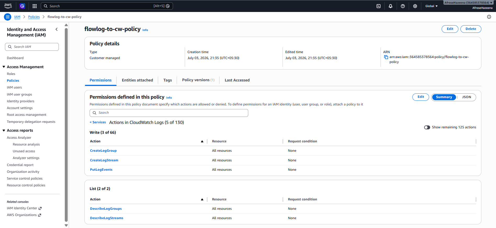
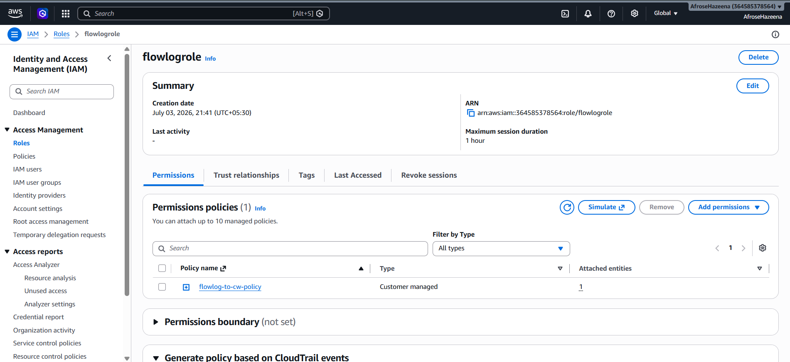
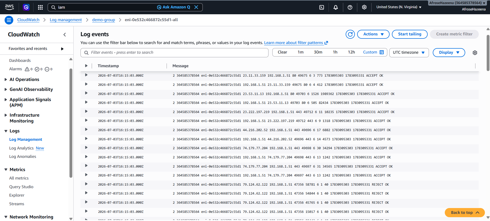

# AWS Lab – Amazon VPC Flow Logs

## Overview

Amazon VPC Flow Logs capture information about the IP traffic flowing to and from network interfaces, subnets, or VPCs. They help monitor network traffic, troubleshoot connectivity issues, and improve security by providing visibility into network communication.

In this lab, we create a CloudWatch Log Group, configure the required IAM Policy and Role, enable VPC Flow Logs for an Elastic Network Interface (ENI), and verify that network traffic logs are successfully published to Amazon CloudWatch Logs.

---

## Architecture

### Components

- Amazon EC2
- Elastic Network Interface (ENI)
- Amazon VPC Flow Logs
- Amazon CloudWatch Log Group
- IAM Policy
- IAM Role

---

## Step 1: Launch an EC2 Instance

Launch an Amazon Linux EC2 instance with Apache Web Server.

The EC2 instance generates network traffic that will be captured by VPC Flow Logs.

---

## Step 2: Create a CloudWatch Log Group

Navigate to **CloudWatch → Log Groups** and create a new Log Group.

Configuration:

- **Log Group Name:** `demo-flowlog`

Initially, the Log Group will not contain any Log Streams.

---

## Step 3: Create an IAM Policy

Navigate to **IAM → Policies** and create a custom policy.

Grant permissions required for VPC Flow Logs to publish logs to CloudWatch.

---

## Step 4: Create an IAM Role

Navigate to **IAM → Roles** and create a new IAM Role.

Attach the IAM Policy created in the previous step.

This role allows Amazon VPC Flow Logs to send log data to CloudWatch Logs.

---

## Step 5: Enable VPC Flow Logs

Navigate to the EC2 instance and select its **Elastic Network Interface (ENI)**.

Create a Flow Log with the following configuration:

- **Traffic Type:** All
- **Destination:** CloudWatch Logs
- **Log Group:** `demo-flowlog`
- **IAM Role:** `flowlog-role`

VPC Flow Logs begin collecting network traffic for the selected ENI.

---

## Step 6: Verify Flow Logs

Navigate to **CloudWatch → Log Groups** and open the **demo-flowlog** Log Group.

Verify that Log Streams are created and network traffic records are successfully published.

---

## Conclusion

In this lab, we:

- Launched an Amazon EC2 instance.
- Created a CloudWatch Log Group.
- Configured an IAM Policy and IAM Role.
- Enabled VPC Flow Logs for an Elastic Network Interface (ENI).
- Published Flow Logs to Amazon CloudWatch Logs.
- Verified network traffic using CloudWatch Log Streams.

Amazon VPC Flow Logs provide valuable insights into network traffic, helping improve troubleshooting, monitoring, and security within AWS environments.
