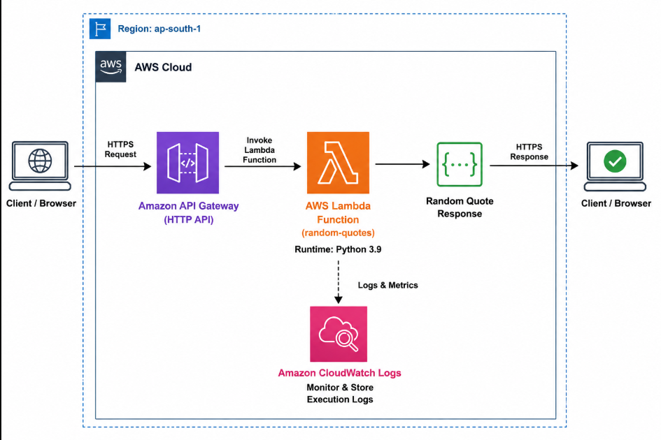
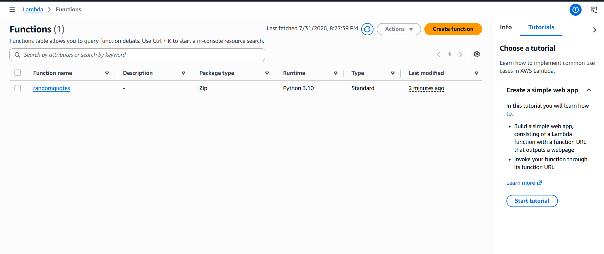
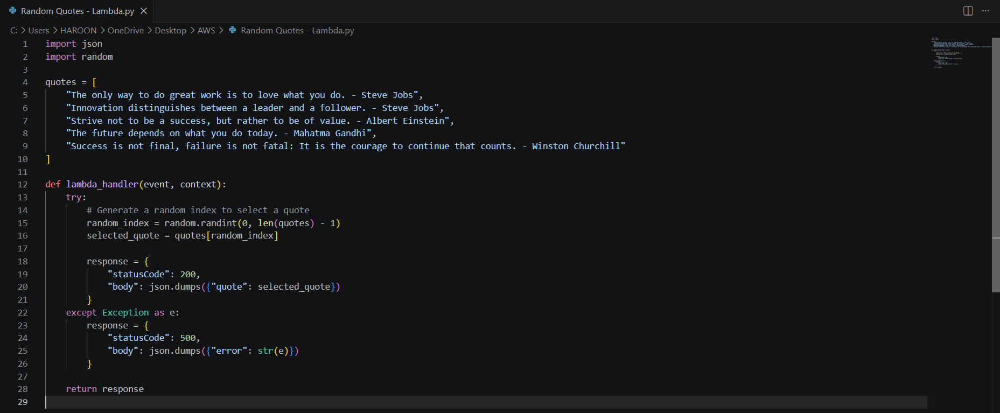
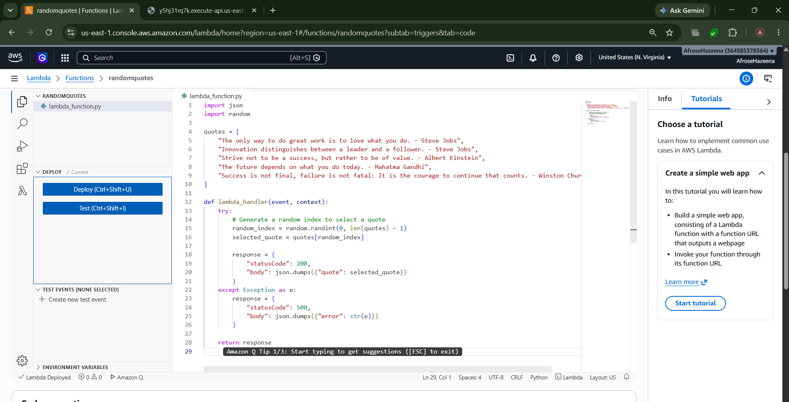
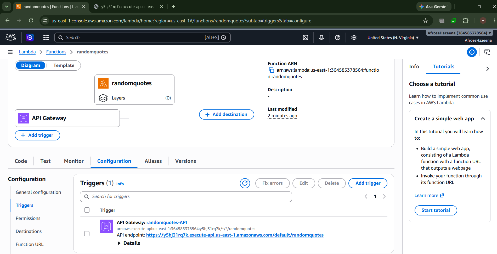
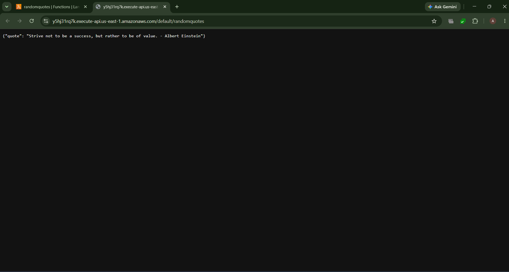

# AWS Lab – AWS Lambda with Amazon API Gateway (Synchronous Invocation)

## Overview

AWS Lambda is a serverless compute service that allows you to run code without provisioning or managing servers. Amazon API Gateway provides a secure and scalable way to expose Lambda functions as HTTP APIs.

In this lab, we create a Python-based AWS Lambda function that returns a random inspirational quote, deploy the function, integrate it with Amazon API Gateway, and invoke it through an HTTP endpoint.

---

## Architecture



### Components

- AWS Lambda
- Amazon API Gateway (HTTP API)
- Amazon CloudWatch Logs
- Python Runtime
- Client (Web Browser)

---

## Step 1: Create an AWS Lambda Function

Navigate to **AWS Lambda** and create a new function.

Configuration:

- **Function Name:** `random-quotes`
- **Runtime:** Python 3.9
- **Execution Role:** Create a new role with basic Lambda permissions

AWS automatically creates an execution role with basic Lambda permissions.



---

## Step 2: Write and Deploy the Python Code

Replace the default Lambda code with a Python script that randomly selects and returns an inspirational quote.

After updating the code, click **Deploy** to save the function.



---

## Step 3: Test the Lambda Function

Click the **Test** tab and execute the function.

The Lambda function runs synchronously and returns a JSON response containing a random quote.

Example response:

```json
{
  "statusCode": 200,
  "body": {
    "quote": "Success is not final, failure is not fatal: It is the courage to continue that counts."
  }
}
```

You can also view the execution details and CloudWatch logs after each invocation.



---

## Step 4: Create an Amazon API Gateway Trigger

Add an **HTTP API Gateway** trigger to the Lambda function.

Configuration:

- API Type: HTTP API
- Integration: AWS Lambda
- API Name: `invoke-lambda`
- Resource Path: `/`

API Gateway automatically creates an endpoint that invokes the Lambda function.



---

## Step 5: Invoke the API

Copy the **Default Endpoint URL** generated by API Gateway.

Open the URL in a web browser or Postman.

Each request invokes the Lambda function and returns a randomly selected inspirational quote.



---

## Conclusion

In this lab, we:

- Created an AWS Lambda function.
- Developed a Python function to return random quotes.
- Deployed and tested the Lambda function.
- Viewed execution results and CloudWatch logs.
- Integrated Lambda with Amazon API Gateway.
- Invoked the Lambda function synchronously through an HTTP endpoint.

AWS Lambda and Amazon API Gateway together provide a fully managed serverless solution for building scalable, event-driven applications and REST APIs without managing infrastructure.
