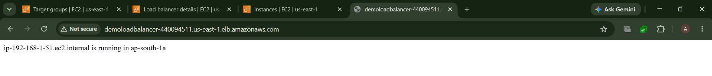
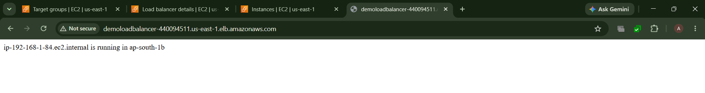
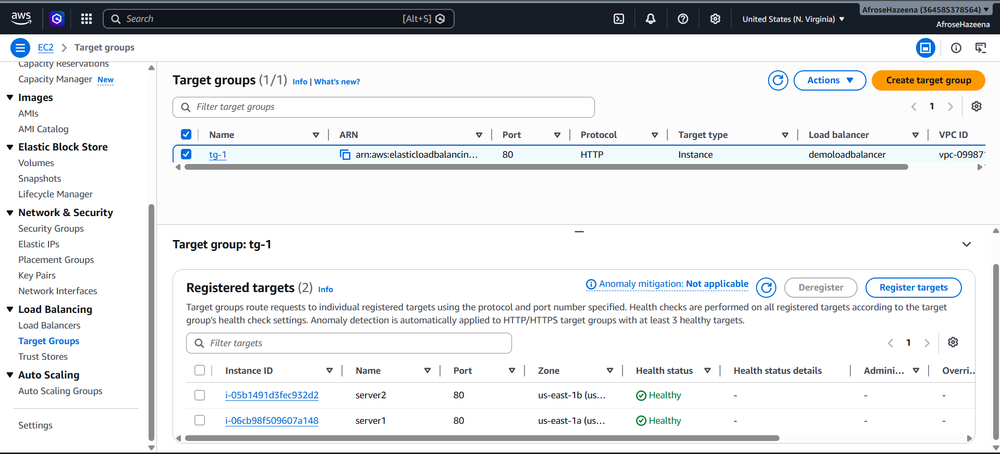
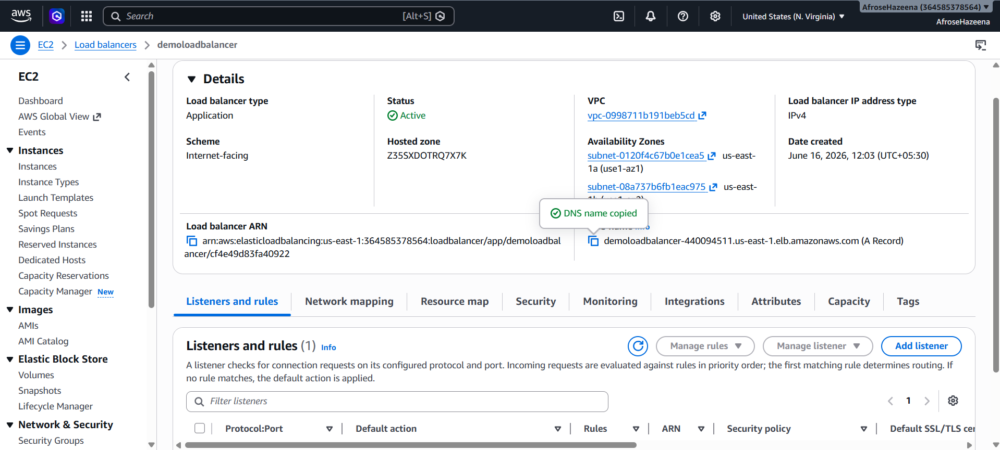

# AWS Lab – Elastic Load Balancer (Application Load Balancer)

## Overview

Amazon Application Load Balancer (ALB) distributes incoming HTTP and HTTPS traffic across multiple Amazon EC2 instances, improving application availability, scalability, and fault tolerance.

In this lab, we deploy web servers in two different Availability Zones, create a Target Group, configure an Application Load Balancer, and verify that incoming requests are automatically distributed across healthy EC2 instances.

---

## Architecture

.png)

### Components

- Amazon VPC
- Public Subnets
- Amazon EC2 Instances
- Application Load Balancer (ALB)
- Target Group
- Security Groups

---

## Step 1: Launch EC2 Instances

Launch two Amazon EC2 instances in separate public subnets.

- EC2 Instance 1 (Availability Zone 1)
- EC2 Instance 2 (Availability Zone 2)

Configure Apache Web Server using EC2 User Data so that each instance hosts a simple web page.

---

## Step 2: Create a Target Group

Navigate to **EC2 → Target Groups** and create a new Target Group.

Configuration:

- **Target Type:** Instances
- **Protocol:** HTTP
- **VPC:** Custom VPC

Register both EC2 instances as targets.

The Target Group allows the Application Load Balancer to distribute traffic only to healthy instances.

---

## Step 3: Create an Application Load Balancer

Navigate to **EC2 → Load Balancers** and create an **Application Load Balancer**.

Configure:

- Internet-facing Load Balancer
- HTTP Listener (Port 80)
- Custom VPC
- Public Subnets in two Availability Zones
- Associate the previously created Target Group

AWS automatically provides a DNS name for accessing the application.

---

## Step 4: Verify Load Balancing

Open the DNS name of the Application Load Balancer in a web browser.

Refresh the page multiple times.

The requests are automatically distributed between the two EC2 instances running in different Availability Zones, demonstrating high availability and load balancing.

🎥 **Load Balancer Demonstration**

https://github.com/your-username/your-repository/blob/main/Load%20balancer/Loadbalancer.mp4

> Replace the above URL with your actual GitHub repository link.

---

## Conclusion

In this lab, we:

- Launched two EC2 web servers in different Availability Zones.
- Configured Apache Web Server using User Data.
- Created a Target Group.
- Registered EC2 instances as targets.
- Created an Internet-facing Application Load Balancer.
- Distributed incoming traffic across multiple EC2 instances.
- Verified high availability using the Load Balancer DNS endpoint.

Amazon Application Load Balancer improves application availability by distributing incoming requests across multiple healthy EC2 instances, ensuring fault tolerance and better user experience.
