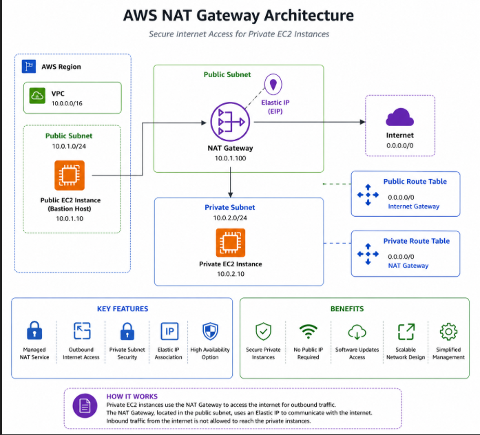
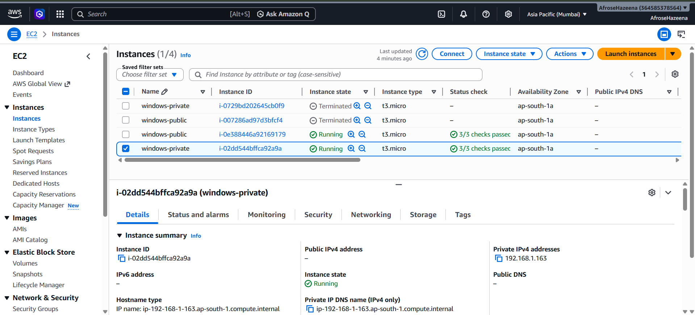
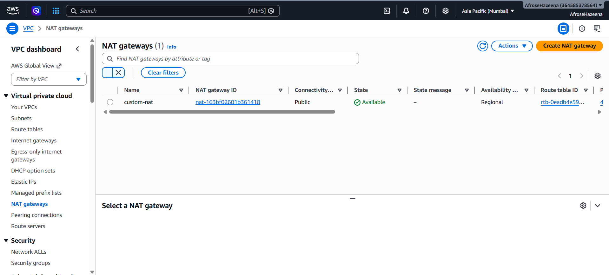
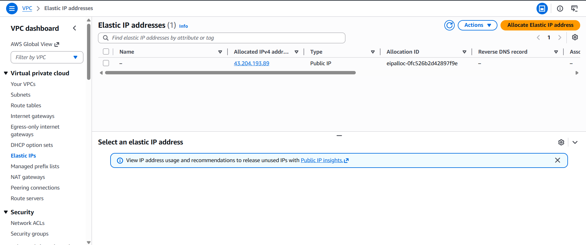
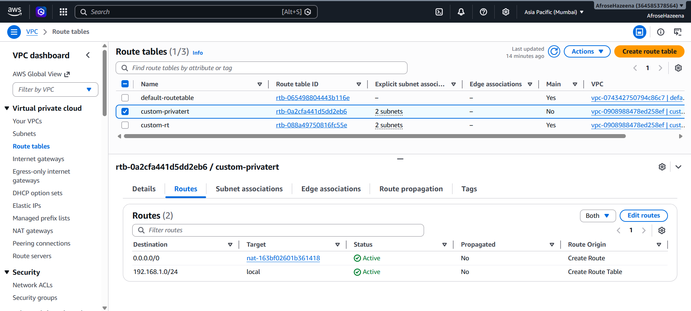

# AWS Lab – Internet Access for Private EC2 Instances Using NAT Gateway

## Overview

Amazon NAT Gateway enables instances in a private subnet to access the internet securely while preventing inbound internet connections.

In this lab, we use an existing VPC with public and private subnets, deploy a NAT Gateway, configure routing, and verify internet access from a private EC2 instance.

---

## Architecture



### Components

- Amazon VPC
- Public Subnet
- Private Subnet
- NAT Gateway
- Elastic IP
- Public EC2 Instance (Bastion Host)
- Private EC2 Instance
- Route Tables
- Internet Gateway

---

## Step 1: Launch EC2 Instances

Launch the following instances:

- Public EC2 Instance (Bastion Host)
- Private EC2 Instance

The public instance will be used to connect to the private instance.



---

## Step 2: Create a NAT Gateway

Create a NAT Gateway in the public subnet.

Amazon automatically requires an Elastic IP during NAT Gateway creation.



---

## Step 3: Verify Elastic IP

This allows the NAT Gateway to communicate with the internet.



---

## Step 4: Configure Route Tables

Update the route table associated with the private subnet.

Add the following route:

```text
Destination: 0.0.0.0/0
Target: NAT Gateway
```

This enables outbound internet access from the private subnet through the NAT Gateway.



---

## Step 5: Verify Connectivity Using RDP

Connect to the public EC2 instance using RDP.

From the public instance, establish a connection to the private EC2 instance.

This confirms network communication between the public and private instances.

.png)

---

## Step 6: Verify Internet Connectivity from the Private Instance

Log in to the private EC2 instance and verify internet access.

Example:

```bash
ping google.com
```

or

```bash
curl https://aws.amazon.com
```

Successful responses confirm that the private instance can access the internet through the NAT Gateway.

.png)

---

## Conclusion

In this lab, we:

- Launched public and private EC2 instances.
- Created a NAT Gateway.
- Allocated and associated an Elastic IP.
- Configured route tables.
- Verified connectivity using RDP.
- Confirmed internet access from a private EC2 instance.

Amazon NAT Gateway provides secure outbound internet connectivity for private subnet resources without exposing them directly to the internet.
