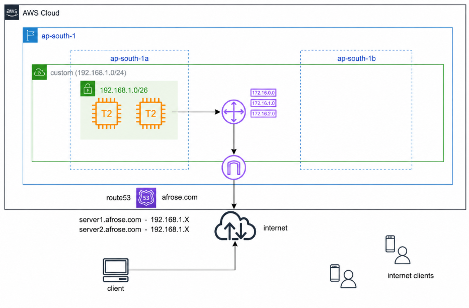
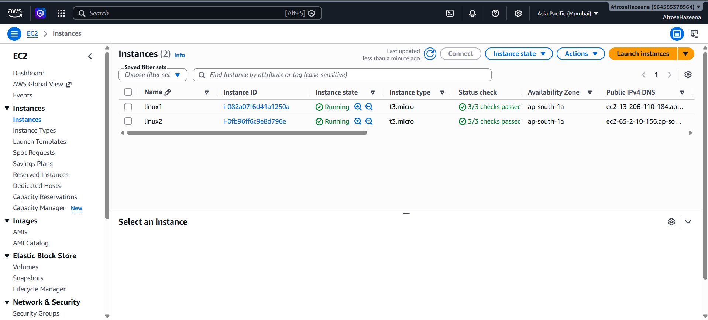
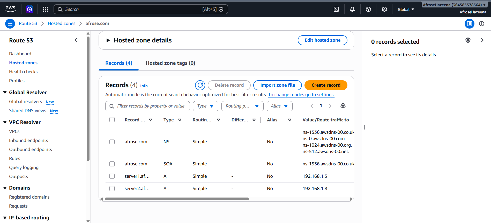

# AWS Lab – Amazon Route 53 Private Hosted Zone

## Overview

Amazon Route 53 is a highly available and scalable Domain Name System (DNS) web service that enables domain name resolution within AWS and over the internet. A **Private Hosted Zone** allows DNS queries to be resolved only within an associated Amazon VPC, enabling secure communication between AWS resources using domain names instead of private IP addresses.

In this lab, we launch two Amazon EC2 instances, create a Route 53 Private Hosted Zone, configure DNS records, and verify private name resolution between the EC2 instances.

---

## Architecture



### Components

- Amazon EC2
- Amazon Route 53
- Private Hosted Zone
- DNS Records (A Records)
- Amazon VPC

---

## Step 1: Launch EC2 Instances

Launch two Amazon Linux EC2 instances in the same Amazon VPC.

- **Instance 1:** `linux1`
- **Instance 2:** `linux2`

Both instances run Apache Web Server using EC2 User Data.



---

## Step 2: Create a Private Hosted Zone

Navigate to **Route 53 → Hosted Zones** and create a new Hosted Zone.

Configuration:

- **Domain Name:** `afrose.com`
- **Type:** Private Hosted Zone
- **Associated VPC:** Custom VPC

The Private Hosted Zone allows DNS resolution only for resources within the associated VPC.


---

## Step 3: Create DNS Records

Create two **A Records** inside the Private Hosted Zone.

Configuration:

- **server1.afrose.com** → Private IP of EC2 Instance 1
- **server2.afrose.com** → Private IP of EC2 Instance 2

These records map domain names to the private IP addresses of the EC2 instances.



---

## Step 4: Verify Name Resolution

Connect to **EC2 Instance 1** using EC2 Instance Connect.

Verify DNS resolution by accessing the instance using its domain name.

Example:

```bash
curl http://server1.afrose.com
```


---

## Step 5: Verify Reverse Communication

Connect to **EC2 Instance 2**.

Verify communication with the instance using its domain name.

Example:

```bash
curl http://server2.afrose.com
```


---

## Conclusion

In this lab, we:

- Launched two Amazon EC2 instances.
- Created an Amazon Route 53 Private Hosted Zone.
- Associated the Hosted Zone with an Amazon VPC.
- Created DNS A Records for both EC2 instances.
- Verified private DNS name resolution between EC2 instances using domain names.

Amazon Route 53 Private Hosted Zones simplify internal service communication by allowing AWS resources within a VPC to communicate using easy-to-manage domain names instead of private IP addresses.
