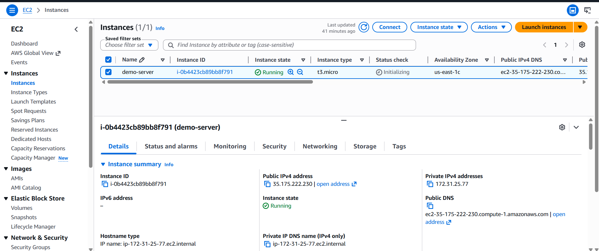
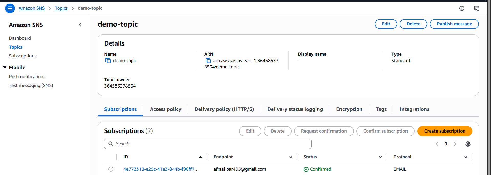
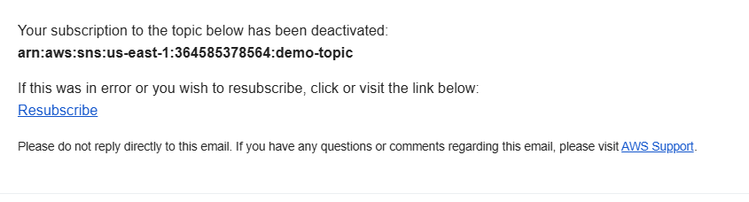
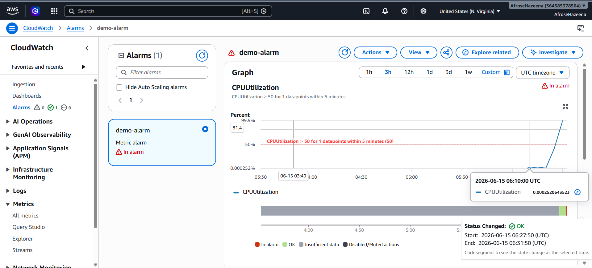
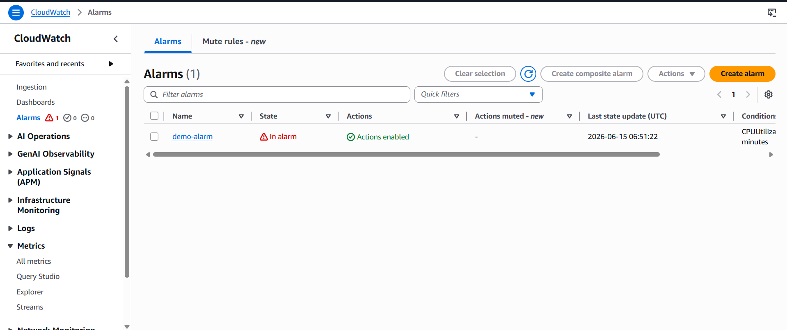
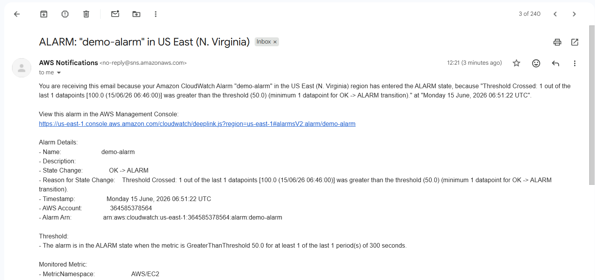

# AWS Lab – CloudWatch Alarm & Amazon SNS Email Notifications

## Overview

Amazon CloudWatch helps monitor AWS resources by collecting metrics and triggering alarms based on defined thresholds. Amazon Simple Notification Service (SNS) is a messaging service that sends notifications to users or applications when an event occurs.

In this lab, we create a CloudWatch Alarm that monitors EC2 CPU utilization and integrates with Amazon SNS to automatically send email notifications when the CPU usage exceeds a specified threshold.

---

## Architecture

.png)

### Components

- Amazon EC2
- Amazon CloudWatch
- Amazon SNS
- SNS Topic
- SNS Email Subscription
- CloudWatch Alarm

---

## Step 1: Launch an EC2 Instance

Launch an Amazon Linux EC2 instance with the following configuration:

This instance will be monitored using CloudWatch.



---

## Step 2: View CloudWatch Metrics

Open the **CloudWatch Console** and navigate to:

**Metrics → All Metrics → EC2 → Per-Instance Metrics**

Search for your EC2 instance and select the **CPUUtilization** metric to monitor its CPU usage.

---

## Step 3: Create an SNS Topic

Navigate to the **Amazon SNS Console** and create a new topic.

Configuration:

- **Type:** Standard
- **Topic Name:** `demo-topic`

The SNS Topic acts as a communication channel for sending notifications.



---

## Step 4: Create an Email Subscription

Create a subscription for the SNS Topic.

Configuration:

- **Protocol:** Email
- **Endpoint:** Your email address

After creating the subscription, Amazon SNS sends a confirmation email. Open the email and confirm the subscription.



---

## Step 5: Create a CloudWatch Alarm

Navigate to:

**CloudWatch → Alarms → Create Alarm**

Select the **CPUUtilization** metric for your EC2 instance.

Configure the alarm:

- **Threshold:** Greater than **50%**
- **Notification:** Send notification to **demo-topic**
- **Alarm Name:** `demo-alarm`

CloudWatch continuously monitors the CPU utilization and changes the alarm state whenever the threshold is crossed.



---

## Step 6: Generate CPU Load

Connect to the EC2 instance using **EC2 Instance Connect**.

Install the **stress** package:

```bash
sudo dnf install stress -y
```

Generate CPU load:

```bash
sudo stress --cpu 2
```

This command increases the CPU utilization, causing the CloudWatch alarm to trigger.

---

## Step 7: Monitor Alarm State

Return to the CloudWatch console and observe the CPU utilization graph.

Once CPU utilization exceeds **50%**, the alarm changes from **OK** to **ALARM**.



---

## Step 8: Verify Email Notification

When the alarm enters the **ALARM** state, Amazon SNS automatically sends an email notification to all confirmed subscribers.



---

## Conclusion

In this lab, we:

- Launched an Amazon EC2 instance.
- Monitored CPU utilization using Amazon CloudWatch.
- Created an Amazon SNS Topic.
- Configured an email subscription.
- Created a CloudWatch Alarm based on CPU utilization.
- Generated CPU load using the **stress** utility.
- Verified the alarm transitioned to the **ALARM** state.
- Successfully received an email notification through Amazon SNS.

This lab demonstrates how Amazon CloudWatch and Amazon SNS work together to provide automated monitoring and alerting for AWS resources.
