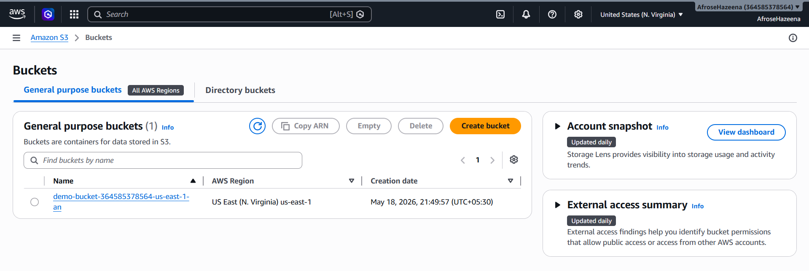
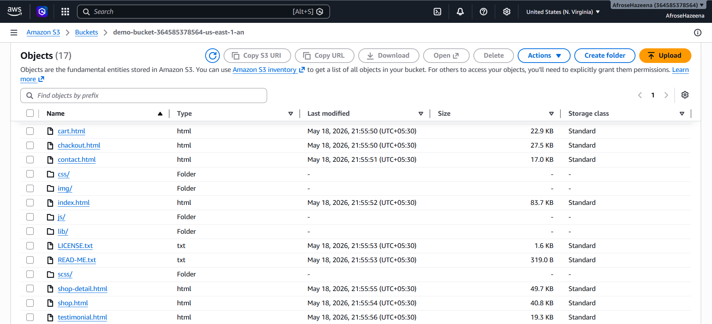
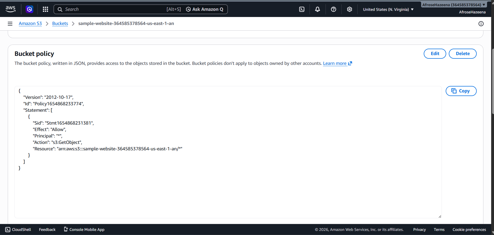
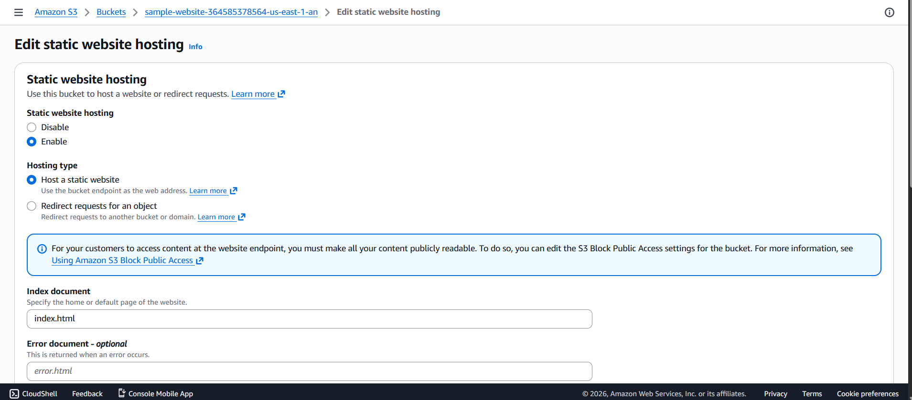
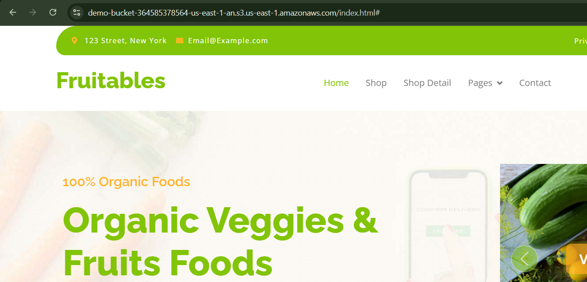

# AWS Lab – Static Website Hosting with Amazon S3

## Overview

Amazon Simple Storage Service (Amazon S3) provides highly durable, scalable object storage and can be used to host static websites. Static website hosting allows you to serve HTML, CSS, JavaScript, images, and other static content directly from an S3 bucket without requiring a web server.

In this lab, we create an S3 bucket, upload website files, configure a bucket policy for public access, and enable static website hosting to make the website accessible through a public endpoint.

---

## Architecture



### Components

- Amazon S3 Bucket
- Static Website Hosting
- Website Files (HTML, CSS, JS, Images)
- Bucket Policy
- Public Website Endpoint
- Internet Users

---

## Step 1: Create an S3 Bucket

Navigate to **Amazon S3** and create a new bucket.

Example:

```text
static-website-demo-bucket
```

Make sure the bucket name is globally unique.


---

## Step 2: Upload Website Files

Upload the website content to the S3 bucket.

Example files:

- index.html
- CSS files
- JavaScript files
- Images

After uploading, verify that all objects are available in the bucket.



---

## Step 3: Configure Bucket Policy

To allow public access to website files, attach a bucket policy.

Example policy:

```json
{
  "Version": "2012-10-17",
  "Statement": [
    {
      "Sid": "PublicReadGetObject",
      "Effect": "Allow",
      "Principal": "*",
      "Action": "s3:GetObject",
      "Resource": "arn:aws:s3:::static-website-demo-bucket/*"
    }
  ]
}
```

This policy allows users to read objects stored in the bucket.



---

## Step 4: Enable Static Website Hosting

Open the bucket and navigate to:

**Properties → Static Website Hosting**

Configure:

```text
Enable: Static Website Hosting
Index document: index.html
```

Save the configuration.



---

## Step 5: Obtain the Website Endpoint

After enabling static website hosting, Amazon S3 generates a website endpoint similar to:

```text
http://static-website-demo-bucket.s3-website-us-east-1.amazonaws.com
```

Use this URL to access the hosted website.

---

## Step 6: Verify Website Access

Open the S3 website endpoint in a web browser.

If the bucket policy and website hosting configuration are correct, the website will be displayed successfully.



---

## Conclusion

In this lab, we:

- Created an Amazon S3 bucket.
- Uploaded static website files.
- Configured a bucket policy for public access.
- Enabled static website hosting.
- Accessed the website using the S3 website endpoint.
- Verified successful static website deployment.

Amazon S3 provides a simple, scalable, and cost-effective solution for hosting static websites without managing web servers.
