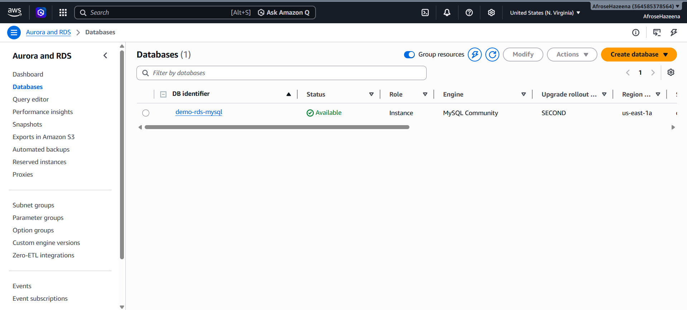
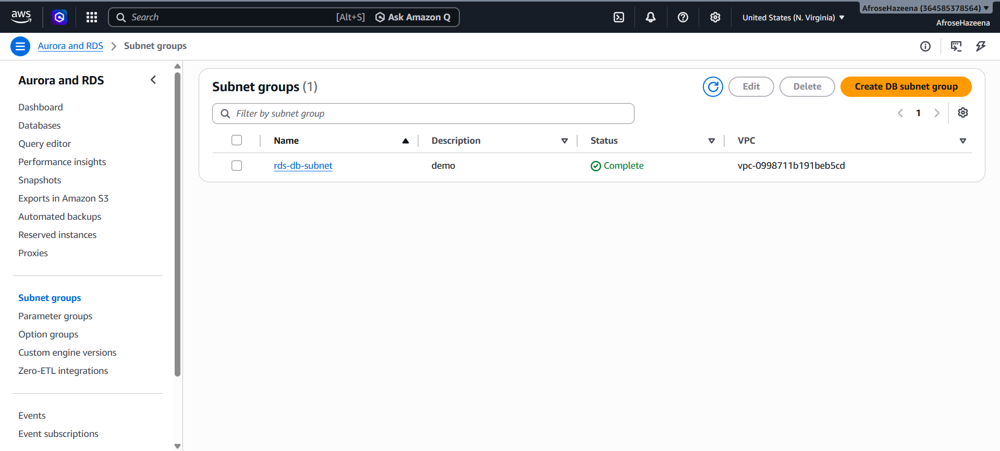

# 🚀 AWS Two-Tier Web Application using EC2, Apache, PHP & Amazon RDS (MySQL)

## 📖 Project Overview

This project demonstrates how to build and deploy a **Two-Tier Web Application** on AWS. The application consists of:

- **Presentation Tier:** Amazon EC2 running Apache Web Server with PHP.
- **Database Tier:** Amazon RDS running MySQL.

The web server connects securely to the MySQL database hosted in a private subnet. Users can submit their Name and Address through a PHP web page, and the data is stored in the RDS database.

---

#  Architecture


---

#  AWS Services Used

- Amazon EC2
- Amazon RDS (MySQL)
- Amazon VPC
- Public Subnet
- Private Subnet
- Security Groups
- Internet Gateway
- Route Tables
- Amazon Linux 2023
- Apache HTTP Server
- PHP
- MariaDB Client

---

#  Architecture Details

| Resource | Configuration |
|----------|---------------|
| Region | us-east-1 (N. Virginia) |
| VPC | Custom VPC |
| Public Subnet | Web Server |
| Private Subnet | RDS MySQL |
| EC2 Instance | t3.micro |
| Database Engine | MySQL |
| Web Server | Apache + PHP |
| Database Name | students |

---

#  Security Groups

## EC2 Security Group

| Type | Port | Source |
|------|------|--------|
| SSH | 22 | My IP |
| HTTP | 80 | Anywhere (0.0.0.0/0) |
| MySQL/Aurora | 3306 | RDS Security Group |

## Amazon RDS Security Group

| Type | Port | Source |
|------|------|--------|
| MySQL/Aurora | 3306 | EC2 Security Group |

---

#  Step 1: Create Amazon RDS MySQL Database

Created an Amazon RDS MySQL database instance using the AWS Free Tier.

### Configuration

- Engine: MySQL
- Template: Free Tier
- DB Identifier: demo-rds-mysql
- Database Name: students
- Public Access: No
- Availability Zone: us-east-1a



---

#  Step 2: Create Database Subnet Group

Created a DB Subnet Group by selecting the private subnets inside the custom VPC.



---

#  Step 3: Launch Amazon EC2 Instance

Created an Amazon Linux EC2 instance inside the public subnet.

### Configuration

- Amazon Linux 2023
- t2.micro
- Existing Key Pair
- Public IP Enabled
- Existing Security Group


---

#  Step 4: Configure Security Group

Configured the EC2 Security Group to allow the required inbound traffic.

Allowed Ports

- SSH (22)
- HTTP (80)
- MySQL/Aurora (3306)


---

#  Step 5: Install Apache, PHP & MariaDB Client

Installed the required packages on the EC2 instance.

```bash
sudo dnf install mariadb105 -y

sudo dnf install httpd php php-mysqli -y

sudo systemctl start httpd

sudo systemctl enable httpd

sudo chown -R ec2-user /var/www
```


---

#  Step 6: Connect EC2 to Amazon RDS

Connected to the RDS MySQL instance using the MariaDB client.

```bash
mysql -u admin -h <RDS-ENDPOINT> -p
```

### Verify Database

```sql
SHOW DATABASES;

USE students;

SHOW TABLES;
```

---

#  Step 7: Deploy PHP Application

Created the following files inside:

```
/var/www/html/
```

Files

- index.php
- dbinfo.inc

The application performs the following tasks:

- Connects to Amazon RDS
- Creates the TERRAFORM table automatically (if it doesn't exist)
- Inserts user records into the database
- Retrieves and displays all stored records

---

#  Step 8: Access the Web Application

Open the EC2 Public IP in your browser.

```
http://<EC2-Public-IP>
```

Enter:

- Name
- Address

Click **Add Data** to save the information into the MySQL database.


---

#  Step 9: Verify Data in Amazon RDS

Reconnect to the MySQL database and verify that the data has been inserted successfully.

```sql
USE students;

SELECT * FROM TERRAFORM;
```


---

#  Project Structure

```
AWS-Two-Tier-Web-Application/
│
├── README.md
├── architecture diagram.png
├── subnet.png
├── database.png
├── linux server.png
├── instance-security group.png
├── Installing apache and mariadb.png
├── Output-web page.png
└── database table.png
```

---

#  Key Features

- Created an Amazon RDS MySQL database.
- Configured a secure VPC with public and private subnets.
- Deployed an Apache Web Server on Amazon EC2.
- Connected EC2 to Amazon RDS using PHP.
- Stored user data dynamically in MySQL.
- Displayed database records on a web page.
- Implemented secure communication using Security Groups.

---

#  What I Learned

- Creating and configuring Amazon RDS MySQL.
- Launching and configuring Amazon EC2.
- Installing Apache, PHP, and MariaDB Client.
- Connecting PHP applications with MySQL.
- Configuring Security Groups for secure communication.
- Building a simple dynamic web application using AWS services.

---

#  Cleanup

To avoid unnecessary AWS charges:

- Stop or Terminate the EC2 Instance.
- Stop or Delete the RDS Database.
- Delete unused Security Groups and DB Subnet Groups.

---

#  Author

**Afrose Akbar**

AWS | DevOps | Cloud Enthusiast

GitHub: https://github.com/AfroseH

LinkedIn: https://linkedin.com/in/afrose-hazeena-7b4b33251/
