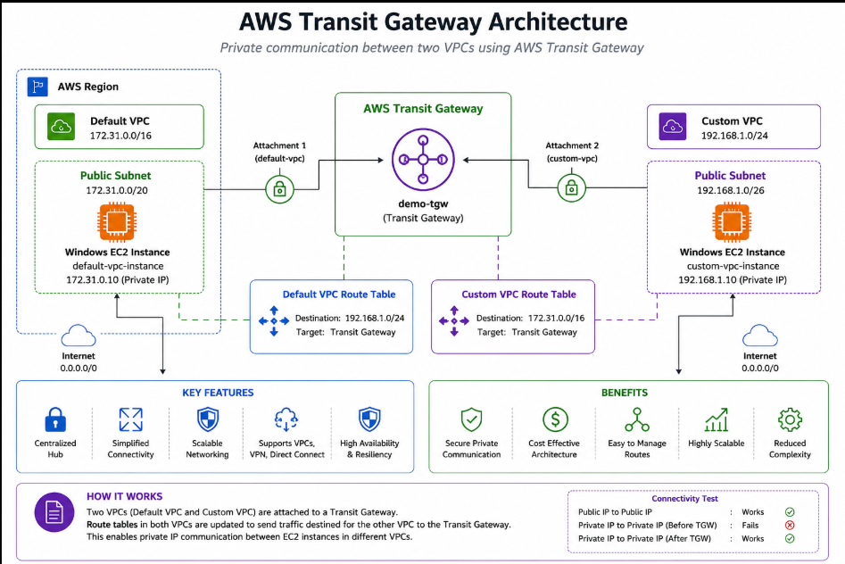
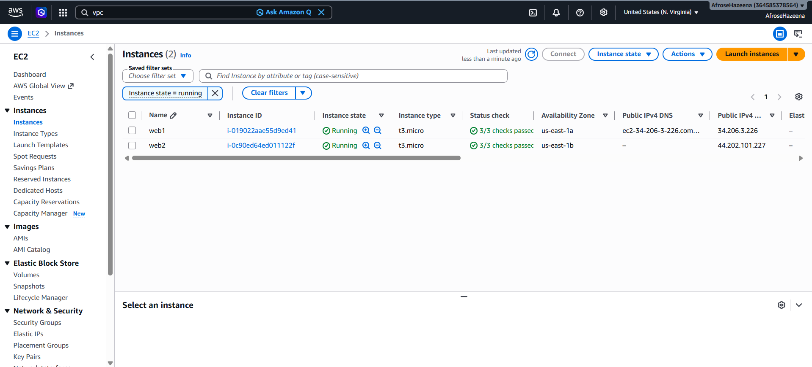
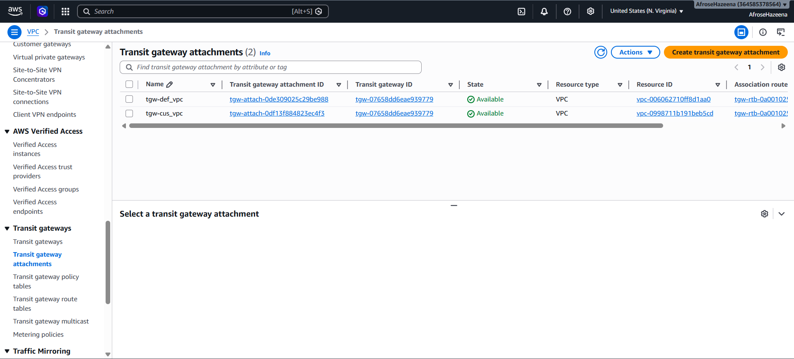
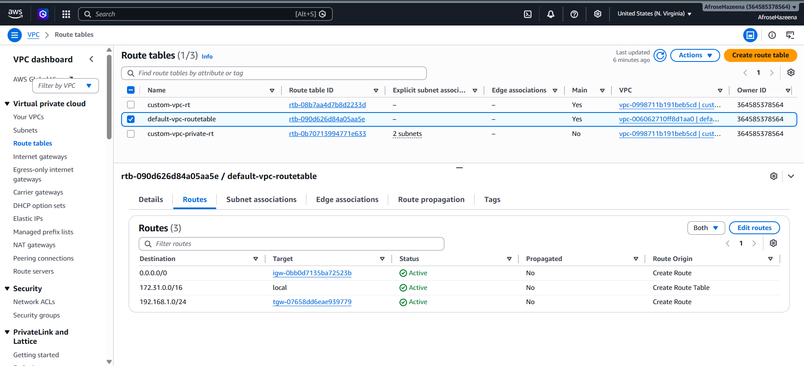
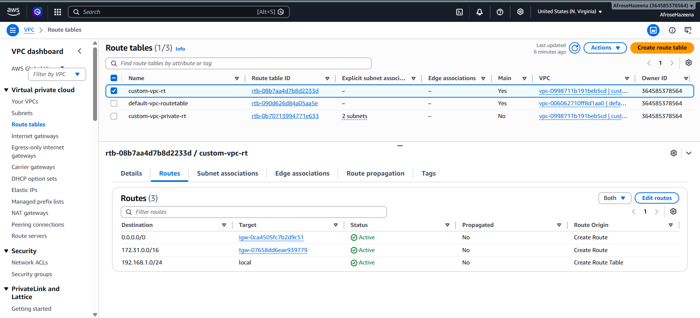

# AWS Lab – Transit Gateway

## Overview

AWS Transit Gateway is a centralized network transit hub that simplifies connectivity between multiple Amazon VPCs, VPN connections, and AWS Direct Connect gateways. Instead of creating complex VPC peering connections, Transit Gateway enables scalable and efficient routing through a single gateway.

In this lab, we create a Transit Gateway, attach two VPCs, configure route tables, and verify private communication between EC2 instances located in different VPCs.

---

## Architecture



### Components

- AWS Transit Gateway
- Default VPC
- Custom VPC
- Transit Gateway Attachments
- Amazon EC2 Instances
- Route Tables
- Public Subnets

---

## Step 1: Launch EC2 Instances

Launch two Windows EC2 instances.

### Instance 1

- **Name:** default-vpc-instance
- **VPC:** Default VPC
- **Subnet:** Default Public Subnet
- **Instance Type:** t2.micro

### Instance 2

- **Name:** custom-vpc-instance
- **VPC:** Custom VPC
- **Subnet:** custom-vpc-public1
- **Instance Type:** t2.micro

Verify that both instances receive public IP addresses.



---

## Step 2: Verify Initial Connectivity

Connect to both EC2 instances using Remote Desktop (RDP).

Test connectivity from the Default VPC instance to the Custom VPC instance.

### Results

- Public IP → Public IP ✅ Works
- Private IP → Private IP ❌ Fails

Since the VPCs are isolated, private communication is not possible at this stage.
---

## Step 3: Create a Transit Gateway

Navigate to:

**VPC Console → Transit Gateways**

Create a Transit Gateway with the following configuration:

```text
Name: demo-tgw
Description: demo
```

Wait until the Transit Gateway status becomes **Available**.


---

## Step 4: Create Transit Gateway Attachments

Navigate to:

**VPC Console → Transit Gateway Attachments**

Create two VPC attachments.

### Attachment 1

```text
Name: attachment1
VPC: Default VPC
Subnet: Public Subnet
```

### Attachment 2

```text
Name: attachment2
VPC: Custom VPC
Subnet: Public Subnet
```

Wait until both attachments become **Available**.



---

## Step 5: Configure Default VPC Route Table

Open the **Default VPC Main Route Table**.

Add the following route:

```text
Destination: 192.168.1.0/24
Target: Transit Gateway
```

Save the route.



---

## Step 6: Configure Custom VPC Route Table

Open the **Custom VPC Main Route Table**.

Add the following route:

```text
Destination: 172.31.0.0/16
Target: Transit Gateway
```

Save the route.



---

## Step 7: Verify Private Connectivity

Reconnect to the Default VPC EC2 instance and test connectivity using the **private IP address** of the Custom VPC EC2 instance.

### Results

- Public IP → Public IP ✅ Works
- Private IP → Private IP (Before Transit Gateway) ❌ Fails
- Private IP → Private IP (After Transit Gateway) ✅ Works

The Transit Gateway successfully enables private communication between both VPCs.


---

## Cleanup

To avoid unnecessary AWS charges:

- Terminate both EC2 instances.
- Delete Transit Gateway Attachments.
- Delete the Transit Gateway.

---

## Conclusion

In this lab, we:

- Launched EC2 instances in two different VPCs.
- Created an AWS Transit Gateway.
- Attached both VPCs to the Transit Gateway.
- Configured route tables for inter-VPC routing.
- Verified successful private communication between EC2 instances.
- Learned how AWS Transit Gateway simplifies scalable and centralized network connectivity.

AWS Transit Gateway provides a highly scalable, secure, and efficient solution for connecting multiple VPCs without the complexity of managing numerous VPC peering connections.
