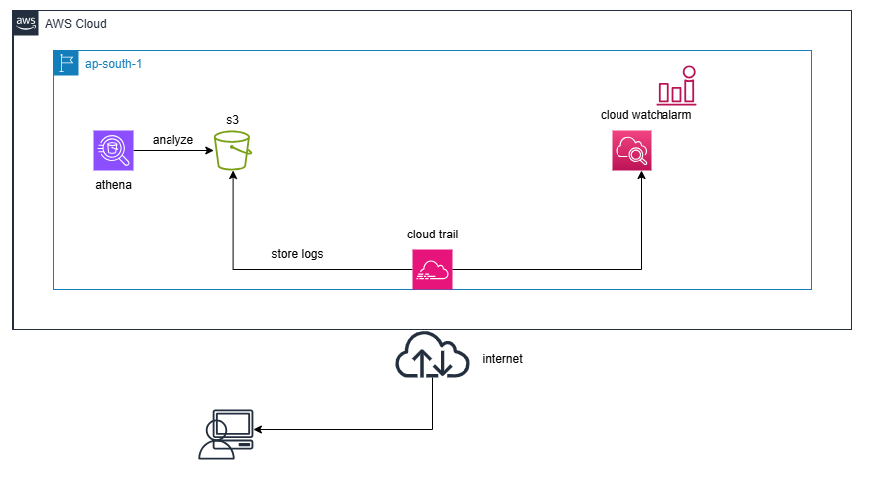
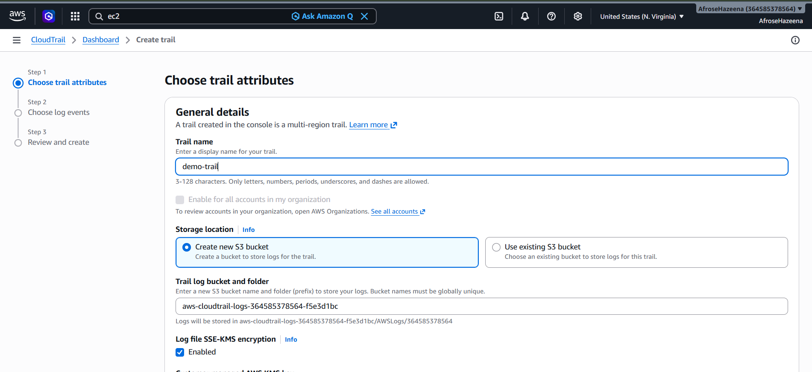
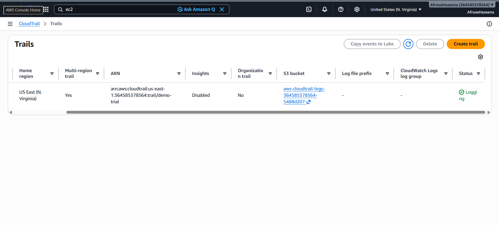
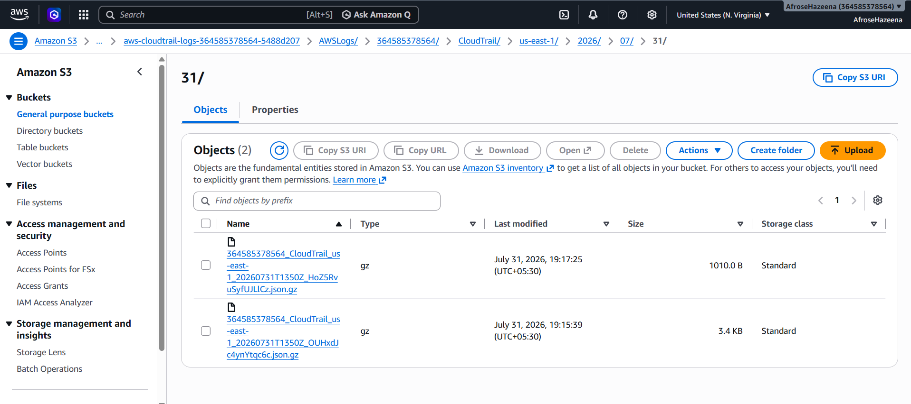

# AWS Lab – AWS CloudTrail

## Overview

AWS CloudTrail is a governance, compliance, and auditing service that records account activity and API calls made within your AWS environment. It captures actions performed through the AWS Management Console, AWS CLI, SDKs, and other AWS services, helping organizations monitor user activity, troubleshoot operational issues, and meet compliance requirements.

In this lab, we create a **multi-region AWS CloudTrail**, configure an Amazon S3 bucket to store audit logs, enable management event logging, and verify that CloudTrail records AWS account activity.

---

## Architecture

### Components

- AWS CloudTrail
- Amazon S3
- AWS Management Console
- AWS CLI / SDK
- Management Events
- Multi-Region Trail

---

## Step 1: Create an AWS CloudTrail

Navigate to **AWS CloudTrail** and create a new trail.

Configuration:

- **Trail Name:** `demo-trail`
- **Apply Trail to All Regions:** Enabled

CloudTrail will begin recording supported AWS API activity across the configured regions.

---

## Step 2: Configure an Amazon S3 Bucket

During trail creation, create a new Amazon S3 bucket to store CloudTrail log files.

Configuration:

- Create a new S3 bucket
- Store CloudTrail logs in the bucket
- Use default encryption settings (SSE-KMS disabled for this lab)

The S3 bucket acts as the central repository for CloudTrail audit logs.

---

## Step 3: Enable Management Events

Configure the trail to record **Management Events**.

These events capture actions performed on AWS resources, such as:

- Creating resources
- Modifying resources
- Deleting resources
- User sign-ins
- IAM operations
- Console and API activity

CloudTrail begins recording these events immediately after the trail is created.

---

## Step 4: Verify CloudTrail Logs

After creating the trail, open the configured Amazon S3 bucket.

Navigate to the **CloudTrail** folder to view the generated log files.

The logs contain detailed information about API calls and account activity across your AWS environment.

---

## Conclusion

In this lab, we:

- Created an AWS CloudTrail.
- Configured a multi-region trail.
- Enabled Management Event logging.
- Created an Amazon S3 bucket for log storage.
- Verified CloudTrail log files in Amazon S3.
- Explored how AWS records account activity for auditing and compliance.

AWS CloudTrail provides continuous visibility into AWS account activity by recording API calls and management events, helping organizations strengthen security, simplify troubleshooting, and meet governance and compliance requirements.
